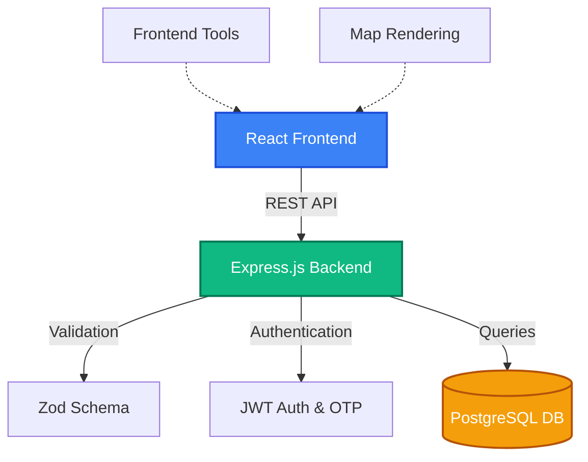
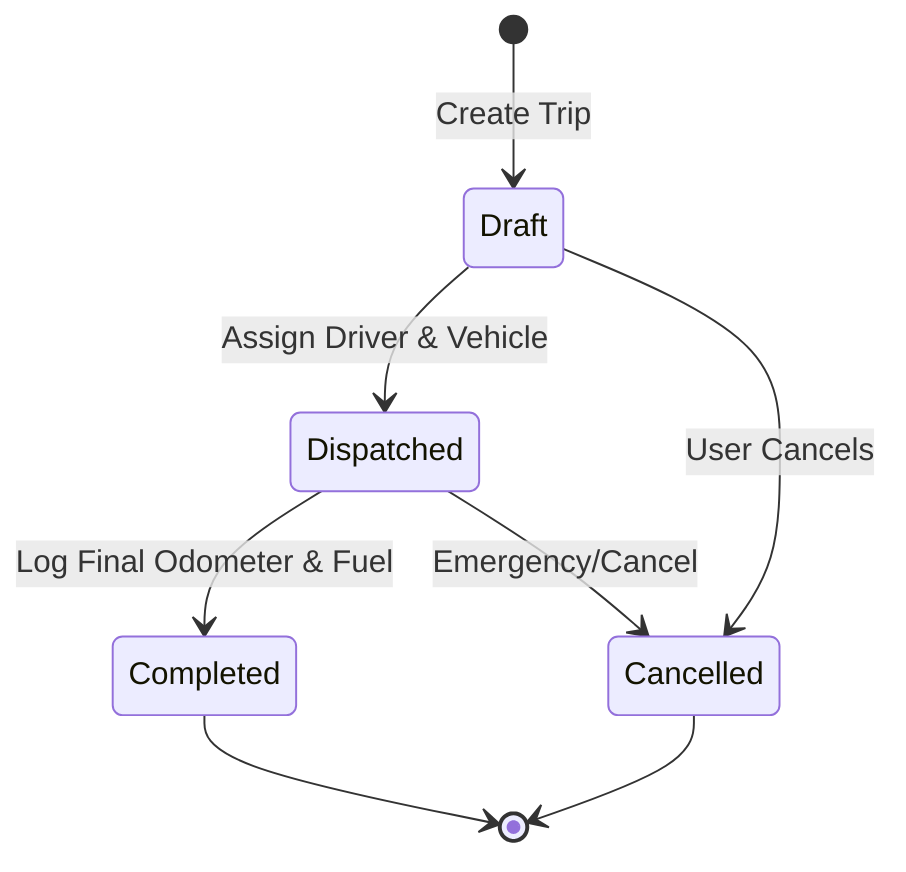
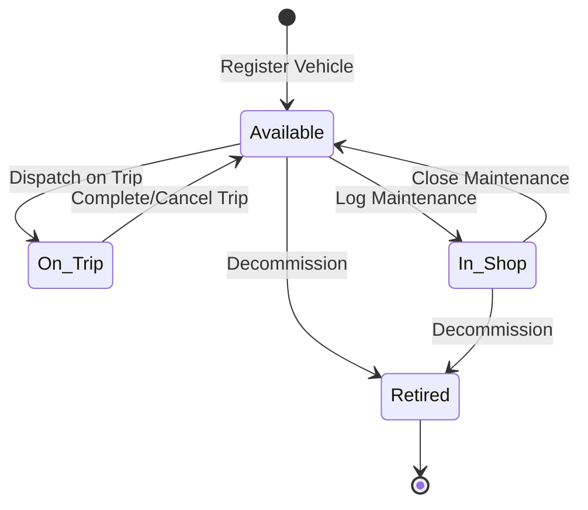

# TransitOps - Fleet Management System

TransitOps is a comprehensive fleet management and logistics platform designed for modern transport companies. It provides real-time visibility into fleet operations, driver management, trip dispatching, and financial analytics.

## 🚀 Features

*   **Secure Authentication & RBAC:** Role-based access control for company administrators and operators with OTP-based login.
*   **Real-time Dashboard:** Live tracking of KPIs including active vehicles, fleet utilization, and operational costs.
*   **Vehicle Registry:** Complete vehicle lifecycle management (ICE & EV) with capacity, odometer, and status tracking (Available, On Trip, In Shop, Retired).
*   **Driver Management:** Maintain driver profiles, monitor safety scores, and track license expiration dates and categories.
*   **Trip Dispatching:** End-to-end trip lifecycle management (Draft, Dispatched, Completed, Cancelled) with cargo and distance tracking.
*   **Maintenance Logs:** Track scheduled and unscheduled maintenance, automatically updating vehicle availability.
*   **Financial Analytics:** Monitor fuel consumption, toll expenses, maintenance costs, and calculate per-vehicle ROI.
*   **Exportable Reports:** Generate detailed fleet performance reports in CSV format.

## 🗺️ System Architecture



## 🔄 Core Lifecycles

### Trip Lifecycle


### Vehicle Status Flow


## 🛠️ Technology Stack

**Frontend:**
*   React 19
*   Vite
*   Tailwind CSS (v4)
*   Framer Motion (Animations)
*   React Leaflet (Maps)
*   Lucide React (Icons)

**Backend:**
*   Node.js & Express
*   PostgreSQL (Database)
*   Zod (Validation)
*   JSON Web Tokens (JWT) & bcryptjs (Security)

## 📦 Installation & Setup

### Prerequisites
*   Node.js (v18 or higher)
*   PostgreSQL
*   npm or yarn

### 1. Clone the repository
```bash
git clone https://github.com/Aikansh-Official/AS_ODOO.git
cd AS_ODOO
```

### 2. Backend Setup
```bash
cd apps/backend
npm install
```
*   Create a `.env` file in the `apps/backend` directory (use `.env.example` as a template).
*   Configure your PostgreSQL database connection string in the `.env` file.
*   Run database migrations (if applicable) or ensure your database is set up.

Start the backend development server:
```bash
npm run dev
```
*The backend will run on `http://localhost:4000`*

### 3. Frontend Setup
Open a new terminal window:
```bash
cd apps/frontend
npm install
```

Start the frontend development server:
```bash
npm run dev
```
*The frontend will run on `http://localhost:5174` (or 5173)*

## 🚦 Usage

1.  Navigate to the frontend URL in your browser.
2.  Click "Create an account" to register a new company.
3.  Check your email (or the backend console if in dev mode) for the OTP.
4.  Log in and start adding vehicles and drivers to your fleet.
5.  Create trips, dispatch them, and monitor your fleet's performance from the Operations Center.

## 📄 License
ISC License
